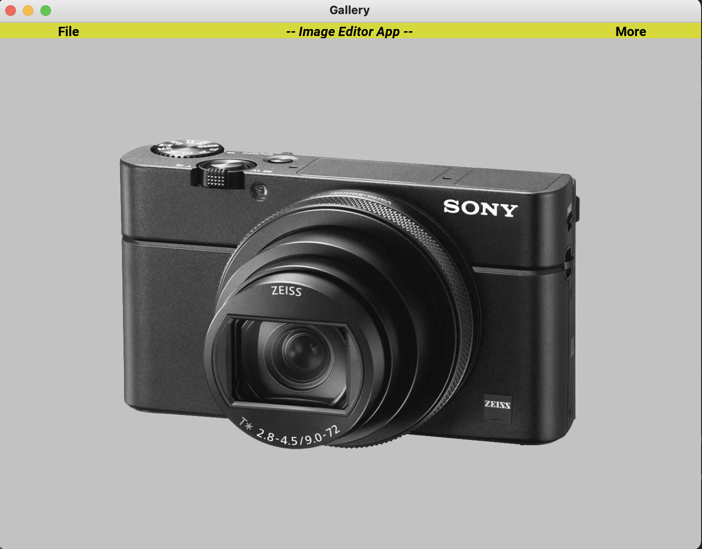
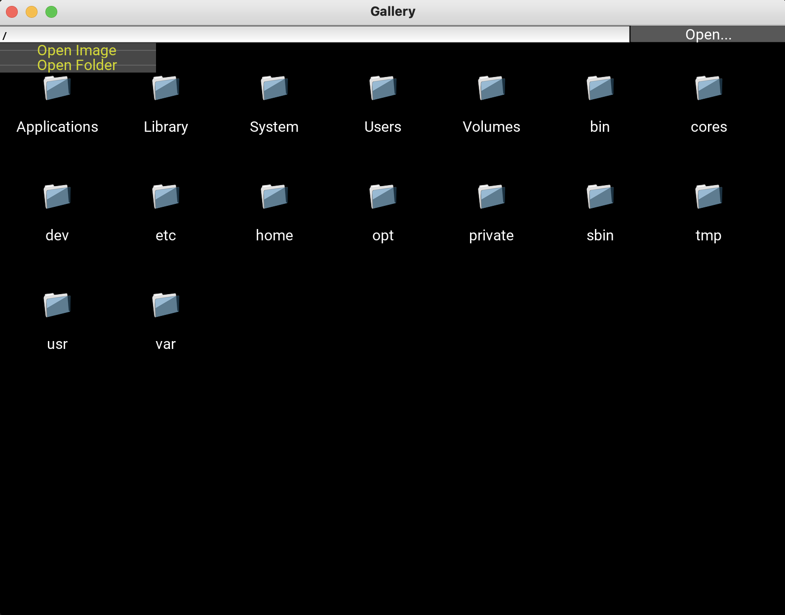
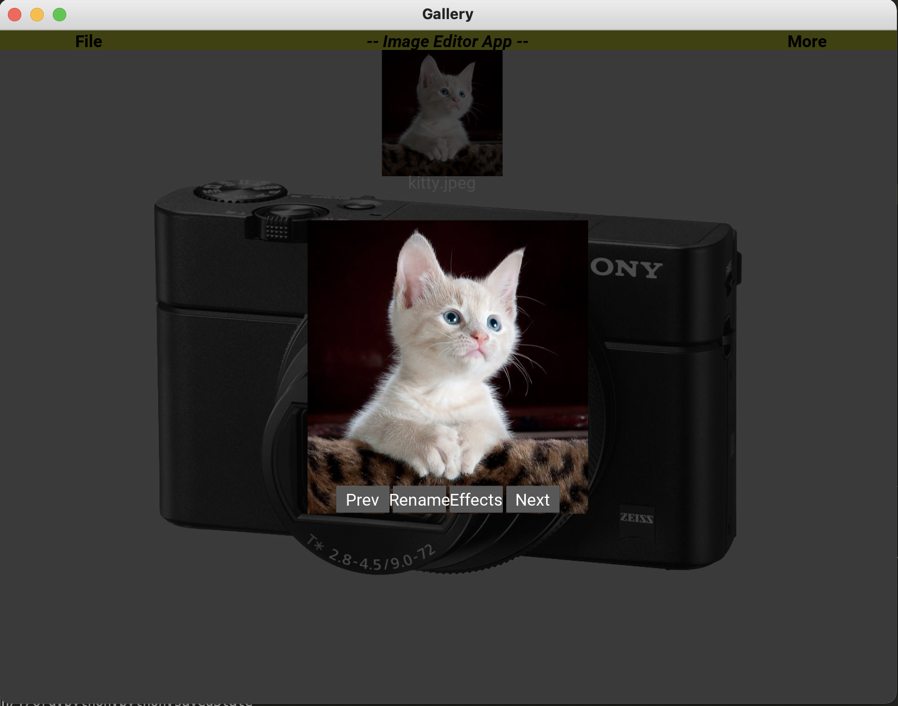

# photo-editing-image-gallery-app-kivy
     
Cross-platform aplication developed in Kivy.  
## Functionalities:
- create image gallery from image folder
- open and edit single images (grayscaling and thresholding)
- save images after edit with renaming option available

## Project setup:
1. `pip install -r requirements.txt`
2. `python main.py`

#### Debug
- Possible Issue: If `python main.py` returns `KeyError: 'kivy.garden.iconfonts'` => Run `garden install iconfonts` => Now `python main.py` should work.
